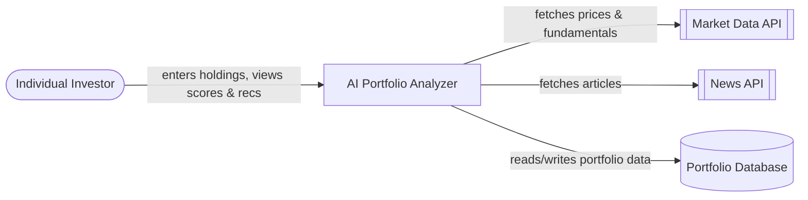
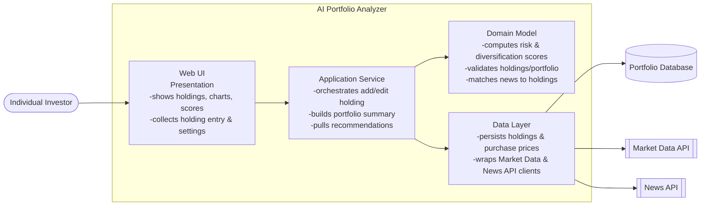
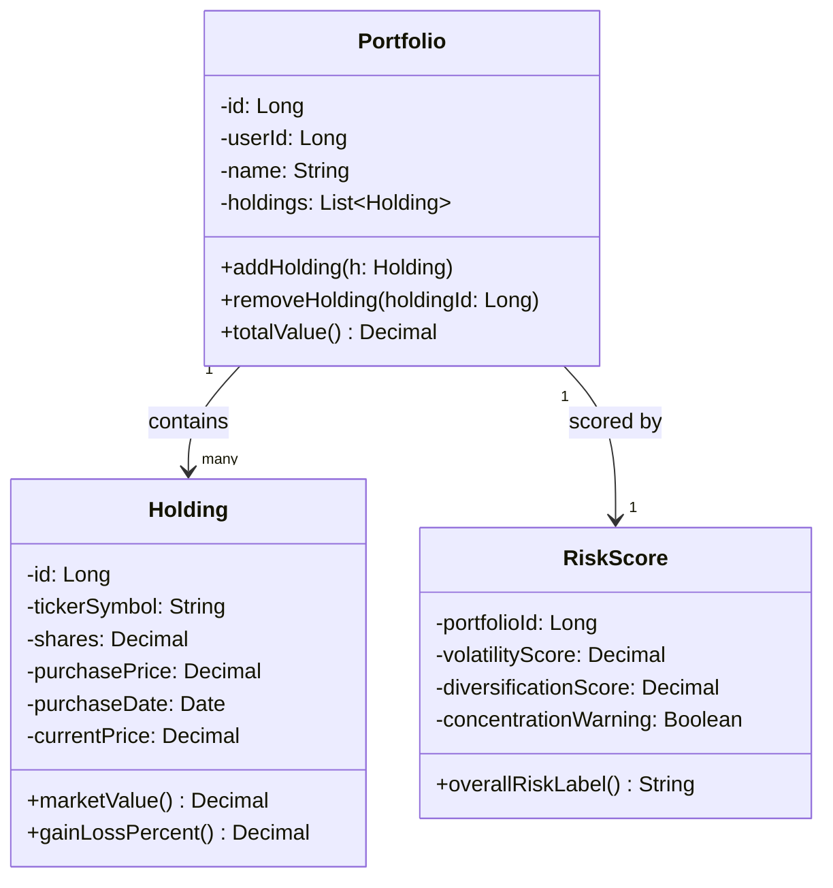
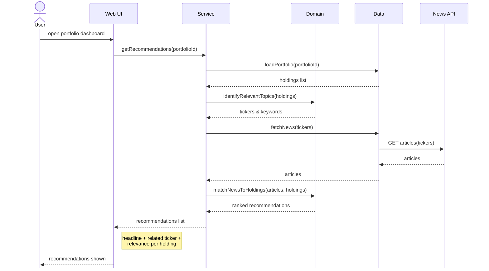

# [Your Project Name]

<!-- CI badge: after Session 4, replace ORG/REPO and the workflow filename, then uncomment:

-->

**Student:** [David Quinones] · **Course:** CEN 5064 Software Design, Fall 2026 · **Partner:** [ASantana0924]

## Project: AI Portfolio Analyzer

The proposed project is a potfolio analysis application that helps users better understand the performance, composition, and risk of their investment portfolios. The target users of the application would be beginner and intermediate individual investors who want a simple way to understand their investments and make action based on the current market. Core features would include:
- allowing users to create a portfolio through manual entry (potentially automatically through API integration)
- displaying performance and allocation metrics
- generating risk and diversification scores
- providing relevant news and recommendations based on the user's holdings

## How to run

Clone the repo, then from the repo root:
\`\`\`
npm install
npm test
\`\`\`

To view the landing page locally:
- Open the repo in VS Code, install the **Live Server** extension if you
  don't have it, right-click `public/index.html` in the file tree, and
  choose **Open with Live Server**. It will open in your browser and
  auto-refresh on save.
- Alternatively, open `public/index.html` directly in a browser (double-click
  the file), or run `npx serve public` and open the printed localhost URL.

There is no backend server yet — this currently only runs the static
landing page and the CI test suite. This section will be updated once
the Service/Domain/Data tiers exist and a real dev server is added.

```
[Exact commands to build and run your system from a clean clone.
Update this every time the steps change — your partner and your
instructor will follow it literally on conference days.]
```

## Architecture

### Tier breakdown (Session 2 studio)

| Tier | Responsibilities in THIS system |
|------|--------------------------------|
| Presentation | Shows the portfolio (holdings, charts, scores) and collects user input (adding holdings, settings) and displays results |
| Service | Orchestrates the main actions a user takes (adding/editing a holding, generating a portfolio summary, pulling recommendations) by calling Domain to do the actual thinking and Data to fetch/save |
| Domain | Handles how risk and diversification scores get calculated, what makes a holding/portfolio valid, and how news gets matched to a user's holdings |
| Data | Stores the user's saved portfolio (holdings, purchase prices) and handles any external APIs (market/price data and news) |

### C4 — Context & Container (Session 3 studio)
 

 

 
### UML — Class & Sequence (Session 3 studio)
 

 


## Architecture Decision Records

Decisions live in [`docs/adr/`](docs/adr/). Start with ADR-001 in Session 4.

| # | Decision | Status |
|---|----------|--------|
| [001](docs/adr/adr-001.md) | [What I am building and why] | [proposed] |

## Weekly log (optional but recommended)

A one-line note per week keeps your commit story readable:

- Week 1 (Aug 24): repo created, three ideas drafted
- Week 2 (Aug 31): ...
