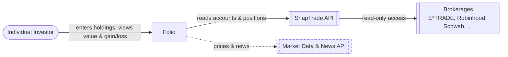
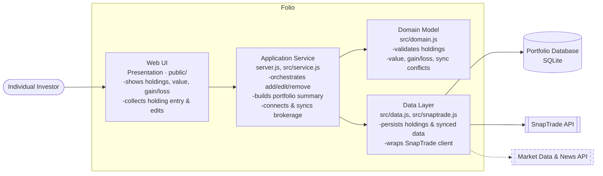
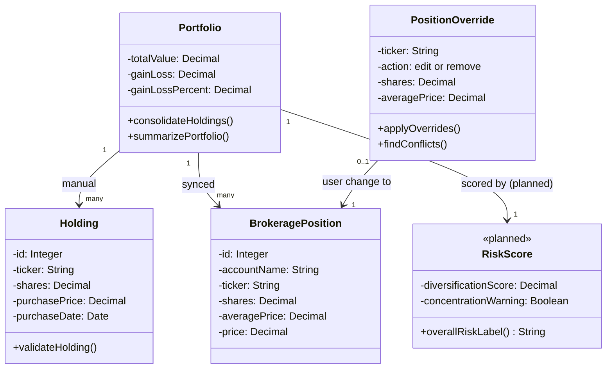
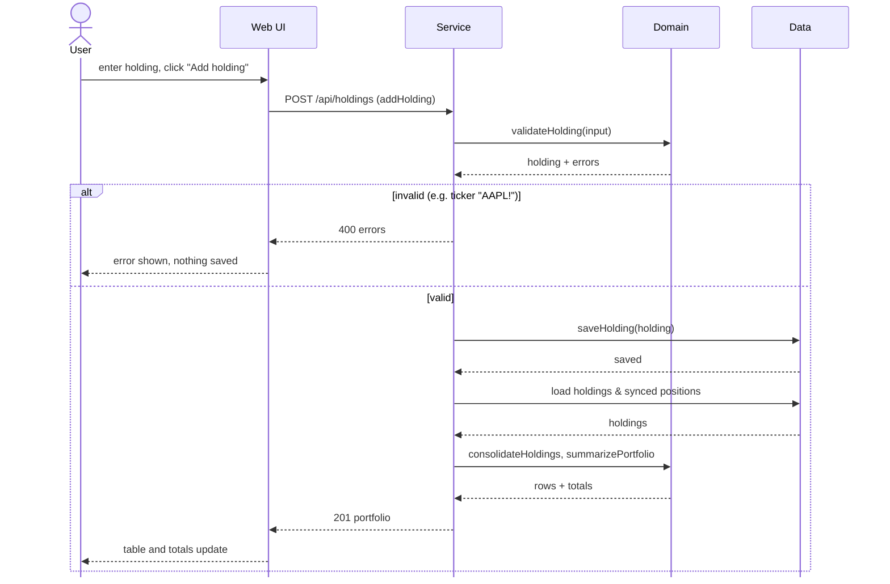
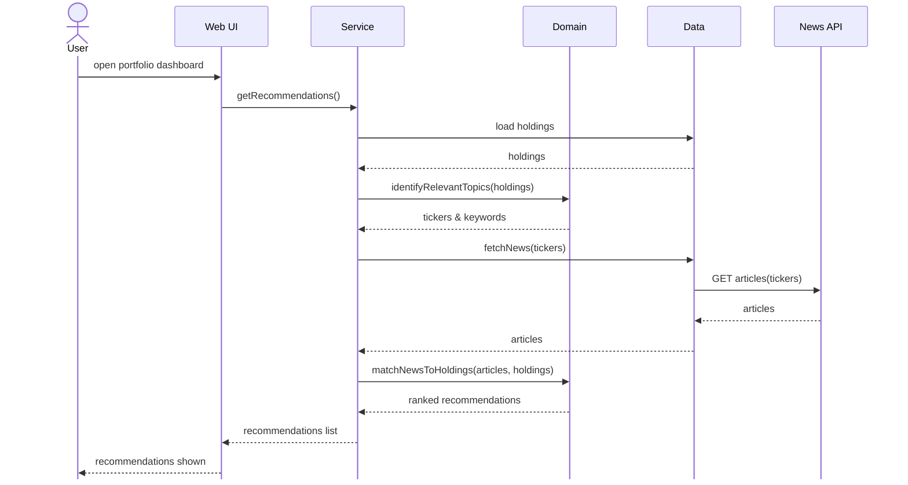

# Folio — AI Portfolio Analyzer

**Student:** David Quinones (@dquin144) · **Course:** CEN 5064 Software Design, Fall 2026 · **Partner:** Alejandro Santana (@ASantana0924)

## Purpose & scope

**What:** Folio is a web app that shows individual investors what they own,
what it's worth, and how they're doing, and (by the end of the semester)
analyzes the portfolio's diversification and risk and surfaces news and
recommendations tied to their holdings.

**For whom:** beginner and intermediate individual investors who hold stocks
and ETFs at one or more brokerages and want a simple, plain-language view of
their portfolio without building spreadsheets.

**Core use cases**

| # | Use case | Status |
|---|----------|--------|
| UC1 | **Build and maintain a portfolio by hand:** add a holding (ticker, shares, purchase price, purchase date), edit or remove it; invalid input is rejected | ✅ Working |
| UC2 | **Import holdings from a brokerage:** connect a brokerage read-only (E*TRADE, Robinhood, Schwab, Fidelity, …), sync and disconnect | ✅ Working |
| UC3 | **See how the portfolio is doing:** total value, gain/loss, allocation, diversification and concentration scores | 🟡 Value and gain/loss working; allocation and scores planned |
| UC4 | **Get news and recommendations for my holdings:** rule-based insights and news matched to what the user owns | ⏳ Planned |

**Scope:** Folio runs locally for a single user, covers US stocks and ETFs, and
only reads brokerage data (no trading). Connecting a brokerage was only a
"maybe" in the original proposal; it was added early because it is the easiest
way to fill a portfolio.

## How to run

> **Requires Node 22.13 or later** (Node 24 recommended). Check with `node -v`.
> On older versions the tests and server fail with an error mentioning
> `node:sqlite` or `--env-file-if-exists`; install a current Node from https://nodejs.org.

From the repo root after cloning:

1. **Install dependencies:** `npm install`
2. **Run the tests:** `npm test`
3. **Start the app:** `npm start` (stop it with Ctrl+C)
4. **Open the portfolio page:** http://localhost:3000/portfolio.html, or open
   http://localhost:3000 and click "Get started" or "Log in" (login isn't
   implemented yet, so both go straight to the portfolio).

No `.env` file or API key is needed for this. Holdings are saved in a local
SQLite database at `data/folio.db`, created automatically on first run.
Live Server doesn't work for the portfolio page, because it needs the Node server.

**Try the core use case (UC1):** click **Add holding** and enter
`AAPL, 10, 150, 2024-01-15`: it appears in the table, and it's still there after
a refresh or a server restart. Enter the ticker `AAPL!` and the Domain tier
rejects it with "Invalid ticker symbol". Click **Edit** on the row to edit or
remove the purchase.

### Optional: connect a brokerage (SnapTrade)

Everything above works without this. To enable "Connect brokerage" you need
your own free SnapTrade API key:

1. Create a **Commercial** account (not Personal) at https://dashboard.snaptrade.com,
   verify your email, and turn on two-factor authentication.
2. On the **API Keys** page, create a **test** key. Copy the **Client ID** and
   **Consumer Key** right away and keep the Consumer Key private.
3. Copy `.env.example` to `.env` and paste the two values into
   `SNAPTRADE_CLIENT_ID` and `SNAPTRADE_CONSUMER_KEY`. `.env` is gitignored —
   never commit real keys.
4. Restart `npm start`, click **Connect brokerage**, and sign in to your
   brokerage on the page that opens. You'll be sent back to Folio and your
   holdings sync automatically. **Sync accounts** refreshes them;
   **Disconnect** revokes SnapTrade's access and removes synced holdings.

Access is read-only. The free tier allows one connected user. Stocks, ETFs and
mutual funds in USD are imported; options, crypto and cash are skipped for now.

## Architecture

### N-tier architecture

Four tiers, each with its own files:

| Tier | Files | Responsibilities in Folio |
|------|-------|---------------------------|
| **Presentation** | `public/index.html`, `public/portfolio.html` | Landing page; portfolio dashboard (summary tiles, holdings table, purchase history); dialogs to add, edit and remove holdings, connect a brokerage, and resolve sync conflicts. Sends input to the server as JSON and renders the result. **No business rules and no storage access.** |
| **Service** | `server.js` (HTTP entry), `src/service.js` | Orchestrates each use case: add/edit/remove a holding, build the portfolio view, connect/sync/disconnect a brokerage, resolve sync conflicts. Asks the Domain to decide and the Data tier to load and save. `server.js` only parses requests and maps results and errors to HTTP status codes. |
| **Domain** | `src/domain.js` | The rules, as pure functions: what makes a holding valid (ticker format, shares and price > 0, date not in the future); merging purchases into one row per ticker; value, total value and gain/loss; applying the user's changes to synced holdings and detecting conflicts with fresh brokerage data. No I/O. *Planned:* allocation, diversification score, rule-based insights, matching news to holdings. |
| **Data** | `src/data.js`, `src/snaptrade.js` | `data.js`: all SQLite access (holdings, brokerage accounts, positions, buy history, the user's changes to synced holdings). `snaptrade.js`: the only code that reads the SnapTrade keys or calls SnapTrade; converts its data into Folio's shape. *Planned:* `prices.js` and `news.js`, clients for a market data and news API (e.g. Finnhub). |

**Dependency rule:** dependencies point one way: Presentation → Service →
Domain, and Service → Data. The Domain depends on nothing (it imports no other
module), the Data tier never calls up into Service or Domain, and the
Presentation tier reaches the server only over HTTP. In code this is visible
in the `require` calls: `server.js` imports only `service.js`; `service.js`
imports `domain.js`, `data.js` and `snaptrade.js`; `domain.js` imports nothing.

### C4 — Context

```mermaid
%%{init: {'flowchart': {'nodeSpacing': 40, 'rankSpacing': 60, 'curve': 'basis'}}}%%
flowchart LR
    user([Individual Investor]) -->|enters holdings, views value & gain/loss| system[Folio]
    system -->|reads accounts & positions| snaptrade[[SnapTrade API]]
    snaptrade -->|read-only access| brokerages[[Brokerages<br/>E*TRADE, Robinhood, Schwab, …]]
    system -.->|prices & news| market[[Market Data & News API]]

    classDef planned stroke-dasharray: 5 5
    class market planned
```

*Dashed boxes and lines = planned (not built yet).*

### C4 — Container

```mermaid
%%{init: {'flowchart': {'nodeSpacing': 40, 'rankSpacing': 70, 'curve': 'basis'}}}%%
flowchart LR
    user([Individual Investor])

    subgraph System [Folio]
        direction TB
        ui[Web UI<br/>Presentation · public/<br/>-shows holdings, value, gain/loss<br/>-collects holding entry & edits]
        service[Application Service<br/>server.js, src/service.js<br/>-orchestrates add/edit/remove<br/>-builds portfolio summary<br/>-connects & syncs brokerage]
        domain[Domain Model<br/>src/domain.js<br/>-validates holdings<br/>-value, gain/loss, sync conflicts]
        data[Data Layer<br/>src/data.js, src/snaptrade.js<br/>-persists holdings & synced data<br/>-wraps SnapTrade client]
        ui --> service --> domain
        service --> data
    end

    db[(Portfolio Database<br/>SQLite)]
    snaptrade[[SnapTrade API]]
    market[[Market Data & News API]]

    user --> ui
    data --> db
    data --> snaptrade
    data -.-> market

    classDef planned stroke-dasharray: 5 5
    class market planned
```

*Dashed boxes and lines = planned (not built yet).*

### UML — Class diagram

The core domain concepts. In code they are plain JavaScript objects, and the
operations are pure functions in `src/domain.js`. `RiskScore` is planned.

```mermaid
classDiagram
    direction TB
    class Portfolio {
        -totalValue: Decimal
        -gainLoss: Decimal
        -gainLossPercent: Decimal
        +consolidateHoldings()
        +summarizePortfolio()
    }

    class Holding {
        -id: Integer
        -ticker: String
        -shares: Decimal
        -purchasePrice: Decimal
        -purchaseDate: Date
        +validateHolding()
    }

    class BrokeragePosition {
        -id: Integer
        -accountName: String
        -ticker: String
        -shares: Decimal
        -averagePrice: Decimal
        -price: Decimal
    }

    class PositionOverride {
        -ticker: String
        -action: edit or remove
        -shares: Decimal
        -averagePrice: Decimal
        +applyOverrides()
        +findConflicts()
    }

    class RiskScore {
        <<planned>>
        -diversificationScore: Decimal
        -concentrationWarning: Boolean
        +overallRiskLabel() String
    }

    Portfolio "1" --> "many" Holding : manual
    Portfolio "1" --> "many" BrokeragePosition : synced
    PositionOverride "0..1" --> "1" BrokeragePosition : user change to
    Portfolio "1" --> "1" RiskScore : scored by (planned)
```

### UML — Sequence diagram (UC1: add a holding, built)

```mermaid
%%{init: {'sequence': {'messageMargin': 45, 'mirrorActors': false, 'boxMargin': 15}}}%%
sequenceDiagram
    actor U as User
    participant UI as Web UI
    participant S as Service
    participant Dom as Domain
    participant D as Data

    U->>UI: enter holding, click "Add holding"
    UI->>S: POST /api/holdings (addHolding)
    S->>Dom: validateHolding(input)
    Dom-->>S: holding + errors
    alt invalid (e.g. ticker "AAPL!")
        S-->>UI: 400 errors
        UI-->>U: error shown, nothing saved
    else valid
        S->>D: saveHolding(holding)
        D-->>S: saved
        S->>D: load holdings & synced positions
        D-->>S: holdings
        S->>Dom: consolidateHoldings, summarizePortfolio
        Dom-->>S: rows + totals
        S-->>UI: 201 portfolio
        UI-->>U: table and totals update
    end
```

### UML — Sequence diagram (UC4: news & recommendations, planned)

How the planned news feature will flow once built, using the same tiers.

```mermaid
%%{init: {'sequence': {'messageMargin': 45, 'mirrorActors': false, 'boxMargin': 15}}}%%
sequenceDiagram
    actor U as User
    participant UI as Web UI
    participant S as Service
    participant Dom as Domain
    participant D as Data
    participant N as News API

    U->>UI: open portfolio dashboard
    UI->>S: getRecommendations()
    S->>D: load holdings
    D-->>S: holdings
    S->>Dom: identifyRelevantTopics(holdings)
    Dom-->>S: tickers & keywords
    S->>D: fetchNews(tickers)
    D->>N: GET articles(tickers)
    N-->>D: articles
    D-->>S: articles
    S->>Dom: matchNewsToHoldings(articles, holdings)
    Dom-->>S: ranked recommendations
    S-->>UI: recommendations list
    UI-->>U: recommendations shown
```

## Plan for the second half

A rough plan; the order and scope may shift as the project develops.

| Weeks | Focus | Use case |
|-------|-------|----------|
| 8 | Midterm: merge open work, docs current | — |
| 9–10 | Live prices, allocation breakdown, per-holding gain/loss | UC3 |
| 11–12 | Portfolio scores (diversification, concentration) and news for holdings | UC3, UC4 |
| 13–14 | Recommendations/insights, login, buffer for anything that slipped | UC4 |
| 15–16 | Polish, final docs, final deliverable | — |

**Risks**

- **Free-tier API limits** (market data, SnapTrade): cache prices and fall back to the last brokerage price.
- **Older Node versions** can't run the app: the required version is stated above, and CI runs on Node 24.

## Architecture Decision Records

Decisions live in [`docs/adr/`](docs/adr/).

| # | Decision | Status |
|---|----------|--------|
| [001](docs/adr/adr-001.md) | Use JavaScript/Node across all tiers | accepted |
| [002](docs/adr/adr-002.md) | Use SQLite via built-in `node:sqlite` for the Data tier | accepted |
| [003](docs/adr/adr-003.md) | Use SnapTrade to connect brokerage accounts | accepted |
| [004](docs/adr/adr-004.md) | Keep user edits to synced holdings separate; let the user decide on sync | accepted |
